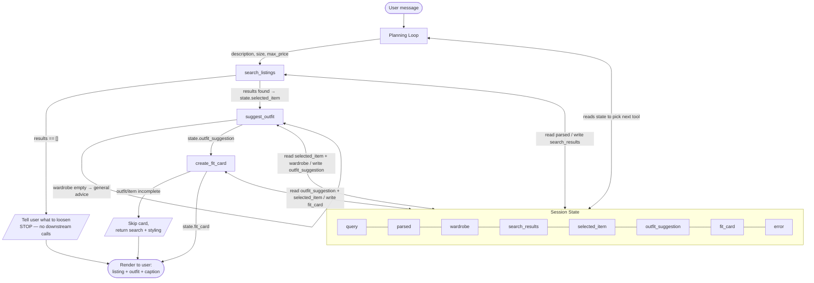

# FitFindr — planning.md

> Complete this document before writing any implementation code.
> Your spec and agent diagram are what you'll use to direct AI tools (Claude, Copilot, etc.) to generate your implementation — the more specific they are, the more useful the generated code will be.
> Your planning.md will be reviewed as part of your submission.
> Update it before starting any stretch features.

---

## Tools

List every tool your agent will use. For each tool, fill in all four fields.
You must have at least 3 tools. The three required tools are listed — add any additional tools below them.

### Tool 1: search_listings

**What it does:**
Filters the secondhand listings dataset (`load_listings()`) by a free-text style description, an optional size, and an optional maximum price, then scores each surviving listing for relevance to the description and returns the best matches sorted high-to-low.

**Input parameters:**
- `description` (str, required): the user's plain-language style query, e.g. `"vintage graphic tee"`. Matched against each listing's `title`, `description`, and `style_tags`.
- `size` (str | None, optional): requested size, e.g. `"M"`. **Loose/optional filter** — a listing passes if its `size` string fuzzily contains the token (`"M"` matches `"M"`, `"S/M"`, `"M/L"`, `"M (oversized)"`) or is a one-size item; size is never a hard exclude when `None`.
- `max_price` (float | None, optional): price ceiling in dollars. A listing passes only if `price <= max_price`. No filter when `None`.

**What it returns:**
A list of up to 3 listing dicts, sorted by descending relevance. Each dict carries the full listing fields (`id`, `title`, `description`, `category`, `style_tags`, `size`, `condition`, `price`, `colors`, `brand`, `platform`) plus an added `relevance` (float) score. Returns `[]` when nothing matches.

**What happens if it fails or returns nothing:**
On `[]`, the agent **stops the chain** — it does not call `suggest_outfit`. It reports back to the user which constraint to loosen (raise `max_price`, drop or change `size`, or broaden the style words), based on which filter eliminated the most candidates.

---

### Tool 2: suggest_outfit

**What it does:**
Takes the chosen listing and the user's wardrobe and produces a short, specific styling suggestion — which owned pieces to pair the new item with and how to wear it — by matching on `category` (fill the gaps the new item doesn't cover), `colors`, and `style_tags`.

**Input parameters:**
- `new_item` (dict, required): a single listing dict, exactly as returned by `search_listings` (the top pick the user is considering).
- `wardrobe` (dict, required): the user's closet in the wardrobe-schema shape — `{"items": [ {id, name, category, colors, style_tags, notes}, ... ]}`. May be the example wardrobe, a user-built one, or empty.

**What it returns:**
A non-empty `str` — a 2–4 sentence styling tip that names concrete wardrobe pieces and says how to wear the new item (tuck, layer, roll sleeves, etc.). The string is what `create_fit_card` and the UI consume directly.

**What happens if it fails or returns nothing:**
If `wardrobe["items"]` is empty, it does **not** invent owned pieces — it returns a general styling-advice string for the new item alone (what pairs well, what vibe it suits) and the agent notes the wardrobe is empty. It never receives empty `new_item` because the chain only reaches it after a successful search.

---

### Tool 3: create_fit_card

**What it does:**
Turns the styling suggestion and the new item into a short, casual, social-media-ready caption (the kind you'd post under a thrift haul) — first-person, includes the price/platform hook, no hashtag spam.

**Input parameters:**
- `outfit` (str, required): the `suggest_outfit` return value — the styling-tip string the caption is built around.
- `new_item` (dict, required): the listing dict, used for the concrete hook (`title`, `price`, `platform`).

**What it returns:**
A `str` — a single ready-to-post caption (≈1–2 short lines), e.g. `"scored this faded bootleg tee on depop for $24 🤍 instant 90s fit"`.

**What happens if it fails or returns nothing:**
If `outfit` or `new_item` is missing/incomplete (no `suggestion`, or no `title`/`price`), it does **not** fabricate a caption — it returns an error signal and the agent skips the fit card rather than posting a hollow one. In normal flow this never triggers, since the tool only runs after `suggest_outfit` succeeds.

---

### Additional Tools (if any)

The three required tools cover search → style → caption. Two stretch features were added:

- **`compare_price(item, listings=None)`** → `dict`. Assesses whether the selected item's
  price is a deal by comparing it to the median price of same-category listings in the
  dataset; returns a verdict (`great deal` / `fair price` / `overpriced` / `no comparison`)
  plus reasoning. Called by the loop right after selecting the top result.
- **Retry with fallback** (`_search_with_fallback` in `agent.py`). When `search_listings`
  returns `[]`, the loop retries with looser constraints (drop size → drop price → drop both)
  and reports which filters it relaxed, instead of stopping on the first miss.

---

## Planning Loop

**How does your agent decide which tool to call next?**

The loop is a fixed-order chain gated by the result of the previous step — each tool runs only if its precondition (set by the prior tool's output) is met. It inspects the session state after every call and branches:

```
1. Parse the user message → { description, size, max_price }.
   IF no usable description  → ask the user to clarify what they're looking for; STOP.

2. Call search_listings(description, size, max_price).
   IF results == []          → tell the user which filter to loosen (price/size/style); STOP.
                               (do NOT call suggest_outfit)
   ELSE                      → store results, pick top result (highest relevance) → state.selected_item.

3. Call suggest_outfit(new_item=state.selected_item, wardrobe=state.wardrobe).
   IF wardrobe is empty      → still proceed, but with general (non-owned-item) advice.
   ELSE                      → store suggestion + referenced_item_ids → state.outfit.

4. Call create_fit_card(outfit=state.outfit, new_item=state.selected_item).
   IF outfit/new_item incomplete → skip the card, return search + styling only.
   ELSE                          → store caption → state.fit_card.

5. DONE → render selected_item + outfit + fit_card to the user.
```

**What changes its behavior:** whether `search_listings` returned anything (hard gate — empty stops the chain), whether the wardrobe has items (soft gate — changes the *style* of advice, not whether step 3 runs), and whether the outfit data is complete (gate on step 4). **Termination:** the loop is done after step 4, or early at any STOP. It is not open-ended — there is no re-planning unless the optional `refine_search` stretch tool is added.

---

## State Management

**How does information from one tool get passed to the next?**

A single per-session `state` dict is the shared memory the planning loop reads and writes between tool calls. Each tool writes its output into `state`; the next tool reads what it needs from `state` rather than re-deriving it:

```python
session = {                        # the dict built by _new_session() in agent.py
    "query":              str,         # original user query
    "parsed":             dict,        # {description, size, max_price} from _parse_query
    "search_results":     list[dict],  # written by search_listings
    "selected_item":      dict|None,   # top result the loop picked → input to both LLM tools
    "wardrobe":           dict,        # set at session start (example or empty)
    "outfit_suggestion":  str|None,    # string written by suggest_outfit
    "fit_card":           str|None,    # caption string written by create_fit_card
    "error":              str|None,    # set (and the loop returns early) if a step can't proceed
}
```

**Flow:** `query` + `wardrobe` are set at session start → `_parse_query` writes `parsed` → `search_listings` writes `search_results` and the loop sets `selected_item` → `suggest_outfit` reads `selected_item` + `wardrobe`, writes `outfit_suggestion` → `create_fit_card` reads `outfit_suggestion` + `selected_item`, writes `fit_card`. The `None` defaults double as guards: a tool's precondition is "the field it depends on is non-`None`." If `search_results` is empty the loop writes `error` and returns before the LLM tools run, so `selected_item`/`outfit_suggestion`/`fit_card` stay `None`.

---

## Error Handling

For each tool, describe the specific failure mode you're handling and what the agent does in response.

| Tool | Failure mode | Agent response |
|------|-------------|----------------|
| search_listings | No results match the query | Stop the chain — do **not** call `suggest_outfit`. Tell the user which constraint to loosen (raise `max_price`, change/drop `size`, or broaden the style words), naming the filter that eliminated the most candidates. |
| suggest_outfit | Wardrobe is empty | Proceed, but return general styling advice for the new item alone with `referenced_item_ids: []`; the agent notes the closet is empty and invites the user to add wardrobe items for personalized pairings. |
| create_fit_card | Outfit input is missing or incomplete | Do not fabricate a caption. Skip the fit card and return the search result + styling suggestion only, so the user still gets a useful answer. |

---

## Architecture



**Control flow:** top-to-bottom chain; each tool fires only when the prior step populated its required state field. **Data flow:** every tool reads its inputs from and writes its outputs to the shared `Session State` (right side), so nothing is recomputed. **Error branches:** an empty search exits immediately to the user (never reaching `suggest_outfit`); an incomplete outfit skips only the fit card.

---

## AI Tool Plan

**Milestone 3 — Individual tool implementations:**

- **`search_listings` — Claude (Claude Code).** Input: the **Tool 1** spec above (inputs, loose-size rule, return shape with `relevance`, empty-result behavior) plus the field list from `utils/data_loader.py`. Expect: a function using `load_listings()` that filters by price/size/description and ranks by keyword overlap against `title`/`description`/`style_tags`. Verify against 3 queries before trusting it — (a) `"vintage graphic tee", max_price=30` should surface `lst_006`/`lst_033`/`lst_002`; (b) a `max_price=5` query should return `[]`; (c) `size="M"` should still admit `"S/M"`/`"M/L"` listings (loose match).
- **`suggest_outfit` — Claude.** Input: the **Tool 2** spec + the wardrobe schema. Expect: a function that returns a styling-tip **string** and degrades to general advice on an empty wardrobe. Verify: run with the example wardrobe (suggestion must name real wardrobe pieces) and with `get_empty_wardrobe()` (still returns a non-empty general-advice string, no crash).
- **`create_fit_card` — Claude.** Input: the **Tool 3** spec. Expect: a one/two-line caption string; error signal on incomplete input. Verify: feed a complete `outfit`+`new_item` (caption mentions price/platform) and a `{}` outfit (returns the error signal, not a fabricated caption).

**Milestone 4 — Planning loop and state management:**

- **Claude (Claude Code).** Input: the **Planning Loop** pseudocode, the **State Management** `state` dict, the **Architecture** Mermaid diagram, and the **Error Handling** table. Expect: a driver that builds `state`, calls the three tools in order, enforces each gate (empty search → STOP before `suggest_outfit`; empty wardrobe → still run; incomplete outfit → skip card), and renders the final listing + outfit + caption. Verify by replaying the **A Complete Interaction** walkthrough end-to-end (must reach a fit card) and the **Error path** query (`max_price` too low → stops after search, never calls `suggest_outfit`).

---

## A Complete Interaction (Step by Step)

Write out what a full user interaction looks like from start to finish — tool call by tool call. Use a specific example query.

**What FitFindr does (in my own words):** FitFindr is a thrift-shopping assistant that takes a user's plain-language wish ("vintage graphic tee under $30") plus their existing wardrobe and walks a three-step chain: it searches the secondhand listings for matching pieces, suggests how to style the best find against what the user already owns, then drafts a social-ready caption for the look. `search_listings` is triggered by the initial request and its filters; `suggest_outfit` only fires once a real listing is found and pairs it with the user's wardrobe; `create_fit_card` only fires once an outfit suggestion exists. If `search_listings` returns nothing the chain stops and FitFindr tells the user what to loosen (price, size, or style), and if the wardrobe is empty `suggest_outfit` falls back to general styling advice rather than referencing owned pieces — it never passes empty input downstream.

**Example user query:** "I'm looking for a vintage graphic tee under $30. I mostly wear baggy jeans and chunky sneakers. What's out there and how would I style it?"

**Step 1 — Search:** The agent parses the request into filters and calls `search_listings(description="vintage graphic tee", size=None, max_price=30.0)`. The dataset returns the under-$30 vintage/graphic-tee matches — `lst_033` (Vintage Band Tee, faded grey, $19), `lst_006` (Graphic Tee, 2003 tour bootleg style, $24, good condition), and `lst_002` (Y2K Baby Tee, $18) — sorted by relevance. The agent picks the top result: **"Graphic Tee — 2003 Tour Bootleg Style — $24, Depop, good condition."**

**Step 2 — Suggest outfit:** Because Step 1 returned a real listing, the agent calls `suggest_outfit(new_item=<lst_006 bootleg graphic tee>, wardrobe=<example wardrobe>)`. It matches the tee against the user's baggy dark-wash jeans (`w_001`) and chunky white sneakers (`w_007`), returning: *"Tuck the front hem of this boxy bootleg tee into your baggy dark-wash jeans and finish with the chunky white sneakers. Throw the vintage black denim jacket over it when it's cooler — the faded graphic and worn-in denim are pure 90s streetwear."*

**Step 3 — Fit card:** Because Step 2 produced an outfit, the agent calls `create_fit_card(outfit=<suggestion>, new_item=<lst_006 tee>)`, which drafts a short, posting-ready caption: *"scored this faded 2003 bootleg tee on depop for $24 🤍 tucked into my baggy jeans + chunky sneakers and it's an instant 90s fit. full look soon"*

**Final output to user:** The user sees the matched listing (title, price, platform, condition), the styling suggestion built from pieces they already own, and the ready-to-post fit-card caption — a complete "found it → here's how to wear it → here's how to post it" answer in one reply.

**Error path:** If `search_listings` had returned no matches (e.g. "neon vintage graphic tee under $10"), the agent stops after Step 1 and replies with what to adjust — "Nothing under $10 matched; try raising the budget to ~$20 or dropping the 'neon' color" — and never calls `suggest_outfit` or `create_fit_card` with empty input.
